# CostGuard architecture

> **Business objective:** cut the LLM spend of ShopNest's support assistant by **≥ 30%** on a frozen, realistic request trace while retaining **≥ 95%** of baseline answer quality, with no change to the calling service beyond its `base_url`.

CostGuard is a **service-side gateway**. The operator runs it between its own backend services and the LLM provider. End users never call it, and the savings land on the operator's bill.

It speaks the OpenAI chat-completions API, so any OpenAI SDK client switches over by changing one line. It routes each request through five cost levers, ordered from safest to riskiest for quality. Every request is recorded as exactly one `TraceRecord`.

Related documents:

- [DESIGN_DECISIONS.md](DESIGN_DECISIONS.md): trade-offs, failure modes and what breaks at 10×.
- [RUNBOOK.md](RUNBOOK.md): deploy, rollout, rollback, alerts.
- [CONTRACT.md](CONTRACT.md): the interfaces between stages.
- Per-stage write-ups by each workstream: [semantic_cache.md](components/semantic_cache.md), [context_and_compression.md](components/context_and_compression.md), [router_and_gate.md](components/router_and_gate.md).

---

## 1. End-to-end data flow

Every edge is labelled with its mode (**sync** or **async**), its protocol and its data format. Solid edges are on the request path; dotted edges are not.

```mermaid
flowchart LR
    CL["Client service<br/>(OpenAI SDK, base_url = CostGuard)"]

    subgraph CG["CostGuard process: FastAPI + uvicorn, one container"]
        direction LR
        GW["Gateway<br/>auth: caller key → tenant + mode<br/>validate ChatRequest"]
        S1["1 Exact cache<br/>in-memory dict, TTL + LRU"]
        S2["2 Semantic cache<br/>bge-small embed → top-k in partition<br/>→ τ → guards"]
        S3["3 Context optimiser<br/>cross-encoder rerank → dynamic-k<br/>→ whole-doc budget"]
        S4["4 Compressor<br/>query-aware extractive<br/>(context block only)"]
        S5["5 Router<br/>hardness signals + category<br/>+ eval-gate file"]
        S6["6 Provider adapter<br/>Anthropic SDK / mock / cassette"]
        S7["7 Cache write-back"]
        TR["8 TraceRecord<br/>cost, baseline, savings,<br/>stage timings"]
        HK["Hooks: Prometheus metrics,<br/>PSI drift monitor"]
        LQ["Langfuse worker thread<br/>(bounded queue)"]
    end

    QD[("Qdrant<br/>vectors + payload")]
    AN["Anthropic Messages API<br/>api.anthropic.com"]
    DB[("SQLite request log<br/>one row per request")]
    LF["Langfuse Cloud"]
    PM["Prometheus / Grafana"]
    DS["Streamlit dashboard"]
    EV["Eval harness + CI gate<br/>(cassette replay)"]

    CL -->|"sync · REST over HTTPS · JSON<br/>POST /v1/chat/completions · Bearer caller key"| GW
    GW -->|"sync · in-process call · ChatRequest"| S1
    S1 -->|"miss · sync · in-process"| S2
    S2 <-->|"sync · HTTP REST :6333 · JSON vectors + payload<br/>(memory backend: in-process numpy)"| QD
    S2 -->|"miss · sync · in-process"| S3
    S3 -->|"sync · in-process · ContextResult"| S4
    S4 -->|"sync · in-process · CompressResult"| S5
    S5 -->|"sync · in-process · RouteDecision"| S6
    S6 -->|"sync · HTTPS · Messages API JSON<br/>x-api-key, explicit base URL, 60 s timeout, 4 retries"| AN
    S6 --> S7 --> TR
    S1 -.->|"hit · sync · cached CacheEntry"| TR
    S2 -.->|"hit · sync · cached CacheEntry"| TR
    TR -->|"sync · in-process · ~20 µs"| HK
    TR -->|"sync · SQLite INSERT (file) · ~0.5 ms"| DB
    TR -->|"async · put_nowait on in-memory queue"| LQ
    LQ -->|"async · HTTPS batches · OTLP spans (SDK v3)"| LF
    TR -->|"sync · REST JSON response + x-costguard-* headers"| CL
    PM -.->|"async pull · HTTP GET /metrics · Prometheus text"| HK
    DS -.->|"async · read-only SQL on log file + eval/results/*.json"| DB
    EV -.->|"offline · in-process library calls (no HTTP hop)<br/>writes eval/results/*.json"| CG
```

**Two paths:**

- **Synchronous request path.** Gateway → stages 1–7 → response. Cache hits return at stage 1 or 2 and never touch the provider.
- **Asynchronous observability path.** The TraceRecord fans out to:
  - **Prometheus**, in process and pulled by the scraper;
  - **the drift monitor**, in process, O(1) per request;
  - **Langfuse**, through a background thread;
  - **the SQLite log**, which the dashboard and eval read offline.

  Monitoring never sits between the user and the answer, with one exception: the request-log write is still synchronous (see §4).

---

## 2. Components

| # | Component | Technology | Why this one | Owner / detail |
|---|---|---|---|---|
| — | **Gateway** | FastAPI + uvicorn; OpenAI-compatible `POST /v1/chat/completions`, `/health`, `/v1/stats` | A drop-in proxy is the most convincing "no code change" demo; FastAPI gives schema validation for free | `costguard/server.py` |
| — | **Tenancy** | Caller API key → tenant + mode (`COSTGUARD_API_KEYS`, `policy.yaml: tenants`) | Body fields come from trusted internal callers; a key, not the body, decides policy | `costguard/server.py`, `configs/policy.yaml` |
| 1 | **Exact cache** | In-process dict, TTL 7 d, LRU 50k entries. Key = sha256(partition, normalised query, context hash) | Zero false-hit risk, ~1 µs. Redis behind the same 3-method interface when there are several replicas | `costguard/cache/exact.py`, [semantic_cache.md](components/semantic_cache.md) |
| 2 | **Semantic cache** | fastembed `BAAI/bge-small-en-v1.5` (ONNX, CPU, local) + brute-force numpy or Qdrant; partition = tenant \| system-prompt hash \| kb_version \| ctx | Local embeddings: $0, no vendor call, τ calibrated on this exact model | `costguard/cache/semantic.py`, [semantic_cache.md](components/semantic_cache.md) |
| 2a | **Hit guards** | Deterministic checks: numbers/IDs, negation, entity lexicon, content-word fallback | A bi-encoder scores "cancel order #4821" ≈ "don't cancel #4822"; a cheap veto beats raising τ for everyone | `costguard/cache/guards.py`, [semantic_cache.md](components/semantic_cache.md) |
| 3 | **Context optimiser** | Cross-encoder `Xenova/ms-marco-MiniLM-L-6-v2` (fastembed ONNX) → dynamic-k → drop whole docs to budget → best-first/second-best-last order | Reranking + dynamic-k beats token dropping on retrieved context; whole docs keep claims with their qualifiers | `costguard/context/optimizer.py`, [context_and_compression.md](components/context_and_compression.md) |
| 4 | **Compressor** | Query-aware extractive (sentence/table-row units, protects numbers). LLMLingua-2 only offline | Fits a 512 MB free host; LLMLingua-2 needs ~2 GB of torch | `costguard/context/compress.py`, [context_and_compression.md](components/context_and_compression.md) |
| 5 | **Router** | Hardness signals + category (hint or embedding-centroid classifier) + `configs/router_gate.json`, written by the offline gate and re-read on mtime change | Downshift is the riskiest lever, so it only fires for categories that passed a paired-CI gate | `costguard/router/`, [router_and_gate.md](components/router_and_gate.md) |
| 6 | **Provider adapters** | Native Anthropic SDK (Sonnet 5.5 strong / Haiku 4.5 cheap), mock, MLX (local), LiteLLM (others); cassette record/replay wrapper | Exact cache-read/write usage fields; explicit endpoint; replay makes CI and re-analysis free | `costguard/providers/` |
| — | **Pricing** | `configs/prices.yaml`: input, output, cached-input and cache-write prices per model, checked 2026-10-03 | One formula, input and output priced separately; baseline = strong tier, full prompt, no cache | `costguard/pricing.py` |
| 8 | **Request log** | SQLite, one `TraceRecord` row per request | Single source of truth for the dashboard, README numbers and A/B; no quota | `costguard/obs/logger.py` |
| — | **Metrics** | prometheus-client, `GET /metrics`, `costguard_*` series | Industry-standard pull model; alert rules live outside the app | `costguard/obs/metrics.py` |
| — | **Drift** | PSI (course W3S2) on TraceRecord features; `GET /v1/drift` + gauges | No embeddings in the hot path; the same maths runs offline in the dashboard | `costguard/obs/drift.py` |
| — | **Tracing** | Langfuse (optional), async background thread, OTel GenAI attribute names | Course-recommended trace UI; never blocks serving; sampled to fit the 50k-unit free tier | `costguard/obs/langfuse_hook.py` |
| — | **Dashboard** | Streamlit + Altair, reads the SQLite log and `eval/results/*.json` | Savings story + monitoring in one place; runs offline | `dashboard/app.py` |
| — | **Eval + CI** | Frozen trace, cassettes, paired bootstrap, eval gate in GitHub Actions | "Savings at equal quality" has to be proven per PR | `eval/`, `.github/workflows/ci.yml` |
| — | **Hosting** | Docker (models baked in) → Render free web service; Compose for local Qdrant | Fly.io and HF Docker Spaces are no longer free; Render is, with sleep | `Dockerfile`, `render.yaml` |

---

## 3. Request lifecycle

1. **Admit.** Parse the OpenAI-format body. Resolve the tenant from the caller key, then the mode from the tenant policy. A body `mode` is honoured only if the tenant allows overrides. Count the original prompt tokens; this count is the baseline used for savings.
2. **Cacheability.** A request is cacheable only if:
   - temperature ≤ 0.3;
   - it is single-turn;
   - `no_cache` is not set.

   Otherwise the cache is bypassed.
3. **Exact cache.** Hash the partition, normalised query and context. A hit returns now with cost $0 and a strong-tier baseline.
4. **Semantic cache.** Embed the query and search its partition. Walk the candidates with similarity ≥ τ(mode); serve the first one that every guard accepts. Always log the best similarity and the guard verdict, including on a miss.
5. **Context optimiser.** Rerank the retrieved docs and keep the ones the question needs, within `context_budget_tokens(mode)`.
6. **Compressor.** Only when the context block is at least `compression_min_tokens`. It touches retrieved context only; the system prompt stays byte-stable, so Anthropic prompt caching on the system prefix keeps working.
7. **Router.**
   - Strong if anything looks hard.
   - Cheap only if the category's gate entry says `allow` (`gated`), or nothing looks hard (`aggressive`).
   - If the cheap tier fails, retry once on strong.
8. **Upstream call.** Bill from the provider's returned usage: input, output, cache reads and cache writes.
9. **Write-back.** Store the answer in both caches, with no-store on errors or empty answers.
10. **Record.** One TraceRecord: cost, baseline cost, savings, per-stage timings, stage errors, config hash. Response headers: `x-costguard-cache`, `-similarity`, `-route`, `-cost-usd`, `-baseline-cost-usd`, `-saved-usd`, `-overhead-ms`, `-config-hash`, `-request-id`.

**Every optional stage fails open.** If it raises, the error lands in `stage_errors` and `costguard_stage_errors_total`, and the request continues un-optimised.

### Latency budget per stage

Budgets are targets set from the non-functional requirements. The measured columns come from `eval/results/loadtest.json`: 50 users, 60 s, 300 ms mock upstream, Apple-silicon laptop, all five stages live.

| Stage | Budget (p99) | Measured p50 | Measured p99 | Notes |
|---|---|---|---|---|
| Token count (baseline) | 2 ms | 0.13 ms | 2.1 ms | tiktoken o200k (local estimate; Anthropic ratio learnt online) |
| 1 Exact cache lookup | 0.1 ms | 0.00 ms | 0.01 ms | dict lookup, n = 6,923 |
| 2 Semantic cache (embed + search + guards) | 15 ms | 0.17 ms | **17.0 ms** | Slightly over at p99 under load: ONNX embed contends for CPU with the reranker; n = 2,981 (runs on exact misses) |
| 3 Context rerank | 40 ms | 25.1 ms | **104.4 ms** | Over budget under 50-user concurrency: CPU-bound cross-encoder on 4–6 docs; first thing to scale (DESIGN_DECISIONS §3); n = 753 |
| 4 Compression | 5 ms | 1.0 ms | **7.5 ms** | Pure Python; n = 52 (runs only when the trimmed block is still ≥ `compression_min_tokens`) |
| 5 Router | 2 ms | 0.14 ms | 2.1 ms | centroid classifier + gate lookup; at budget |
| 6 Upstream | provider | 305 ms | 313 ms | mock = 300 ms sleep; real Sonnet/Haiku TTFT is seconds |
| 7 Write-back | 2 ms | 0.14 ms | 0.8 ms | exact + semantic insert |
| 8 Hooks: metrics + drift | 0.1 ms | ~0.02 ms | — | micro-benchmark: 19 µs + 3 µs per request |
| 8 Request-log write (SQLite) | 1 ms | ~0.5 ms | — | micro-benchmark; synchronous, outside `overhead_ms` |
| **CostGuard overhead, hit path** | **50 ms** | **0.3 ms** | **3.6 ms** | `x-costguard-overhead-ms`, exact + semantic, n = 6,116 |
| **CostGuard overhead, miss path** | **100 ms** | **11.8 ms** | **94.6 ms** | n = 1,552 |
| of which RAG requests with 4–6 docs (cache bypass) | 100 ms | 25.9 ms | **105.8 ms** | n = 745; over budget because of the reranker |
| Miss path, client-observed added latency | 100 ms | 25.1 ms | **124.1 ms** | e2e − 300 ms; adds HTTP, JSON, threadpool queueing, log write |

---

## 4. Requirements

### Functional

1. An OpenAI-compatible `POST /v1/chat/completions`. Drop-in: only `base_url` changes, plus a caller key.
2. An exact-match cache, then a semantic cache with a per-mode threshold τ, deterministic hit guards and tenant/system-prompt/KB-version partitions.
3. Context rerank plus whole-document trimming to a per-mode token budget. Compression of the retrieved-context block only.
4. Strong → cheap model downshift, only for categories that passed the offline eval gate.
5. Modes `off`, `quality`, `balanced` and `economy`, plus per-tenant policy. A kill switch per tenant and per lever.
6. Per-request cost, baseline cost, savings, route and latency breakdown. These go into the log, the response headers, `/v1/stats`, `/metrics` and the dashboard.
7. A replayable fixed trace and cassettes for the A/B. An eval gate in CI.
8. Cache invalidation by TTL, by `kb_version` bump (new partition) and by restart (in-memory tier).

### Non-functional

Each requirement has a value and the design decision it forces.

| Requirement | Value | Design implication |
|---|---|---|
| Added latency, hit path | **p99 < 50 ms** (measured 3.6 ms) | Local embeddings, in-process index; hits never call the provider |
| Added latency, miss path | p99 < 100 ms (measured 94.6 ms; 105.8 ms on RAG requests, the reranker is the stage to fix) | Fast stages only; LLMLingua-2 stays offline; the reranker is CPU-bounded |
| Availability | **Fail-open**: never lower than calling the provider directly; error rate < 0.5% | Each stage's exceptions are swallowed into `stage_errors`; cheap-tier failure retries strong; hooks never raise |
| Quality | **≥ 95% of baseline** judge score (quality retained, paired bootstrap 95% CI) | Per-mode τ from a false-hit budget; per-category gate on the CI lower bound; the CI gate blocks regressions |
| False hits | ≤ 0.5% / 1% / 3% of all requests (quality / balanced / economy) | τ read from the per-request false-hit curve plus guards |
| Cost | **≥ 30% reduction** vs baseline on the frozen trace; reported as cost per correct answer too | Levers ordered by quality risk; savings attributed per lever by cumulative ablation |
| Observability | Every request traceable to a `config_hash`; ≥ 3 of 5 monitoring categories (we cover all 5) | One TraceRecord per request; Prometheus + PSI drift + Langfuse + dashboard |
| Security | No cross-tenant cache leakage; no keys in images or git | Tenant in every cache partition; tenant from the caller key; secrets only via environment |
| Experiment budget | $5–20 total spend | Cassettes and mock for CI and sweeps; the real API only for headline runs |

### Scale assumptions

These are a design point, not measurements.

- **Traffic:**
  - 20,000 requests/day ≈ 0.23 req/s on average;
  - ~1.2 req/s at a 5× peak-to-mean ratio.
- **Prompt sizes:**
  - ~1,200 input tokens on average: no-context questions run ~300 tokens, RAG questions ~2,000;
  - ~150 output tokens.
- **Baseline cost:** at Sonnet 5.5 list prices ($2 / $10 per 1M input / output tokens), about $0.0039 per request, ≈ $78/day ≈ $2.3k/month.
  - That is far below the ~$10k/month break-even for self-hosting (course W3S1). So the levers are **fewer tokens** and **a cheaper tier**, not our own GPUs.
- **Capacity:** one replica sustained **128 req/s with 0 failures** on the mock upstream. That is about 100× the assumed peak. The binding constraints are the provider's rate limits and the CPU-bound miss-path stages, not the gateway.
- **Cache size:** 50k exact entries; at most tens of thousands of 384-dim vectors per partition, so brute-force search stays ~1 ms.

---

## 5. Scope

**In scope:**

- Text chat completions, English, one domain (ShopNest support).
- One strong/cheap pair per backend: Anthropic Sonnet 5.5 / Haiku 4.5 for real runs; mock, MLX and LiteLLM backends for development.
- Single-region, single-replica deployment.
- The cost levers: exact cache, semantic cache, context trimming, compression, gated downshift.
- Per-request cost and latency observability, drift monitoring, the A/B harness and the CI eval gate.

**Out of scope, deliberately:**

- **Streaming responses.** The proxy returns whole completions.
- **Guardrails and safety filtering** (menu project 10).
- **Billing, quotas and per-tenant rate limiting** (menu 8). Tenancy here exists only for policy and cache isolation.
- **Fine-tuning or self-hosted GPU serving.** Below break-even.
- **Multi-turn caching.** Requests with history bypass the cache.
- **Tool calls and multimodal input.**
- **Multi-region or HA deployment.** Render free is a single instance.
- **Online shadow-serving of the semantic cache.** Shadow evaluation is done offline by replaying logged queries (RUNBOOK §3).
